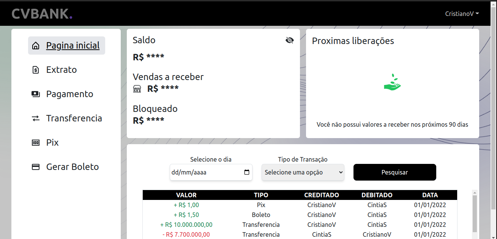
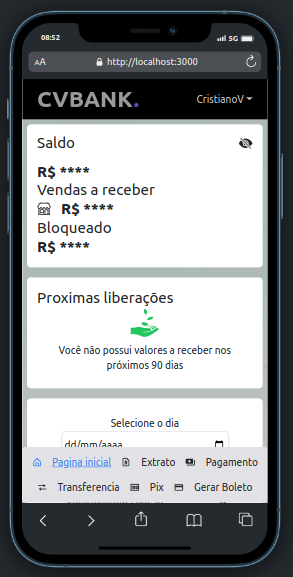

<h1 align="center">
Projeto CVBANK Front-End
</h1>

<div align="center">
  
  
 </div>

## :man_technologist: Tecnologias, bibliotecas e arquiteturas usadas
  * __React__
  * __Next__
  * __axios__
  * __Context__
  * __Typescript__
  * __Tailwindcss__

# Instruções da aplicação

### Iniciar Projeto
```
cd web
npm i
npm start
```
